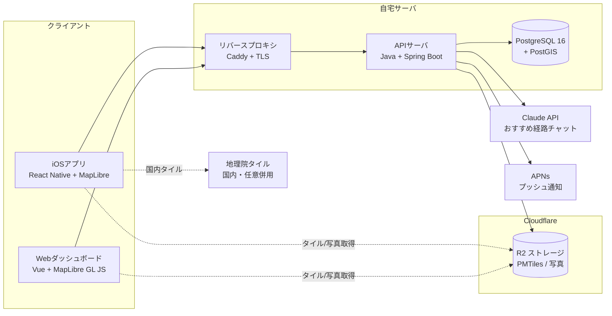

# アーキテクチャと技術選定

## システム構成図

初期（自宅サーバ）フェーズの全体構成を示す。クライアント（モバイル/Web）はAPIサーバと通信し、APIは自宅のPostgreSQL+PostGISを参照する。地図タイルと写真はCloudflare R2から配信し、AIチャットはClaude APIへ中継する。

将来のAWS移行フェーズでは、APIをコンテナ（ECS/Fargate もしくは EC2）、DBを RDS/Aurora PostgreSQL（PostGIS有効）、写真ストレージを S3 + CloudFront に置き換える。PMTilesは引き続きR2またはS3+CloudFrontで配信できる。クライアント側は接続先URLの変更のみで移行できるよう、エンドポイントを環境変数化する。

## 技術スタック

| レイヤー | 採用技術 | 選定理由 |
|---|---|---|
| モバイル | React Native（Expo + Dev Build / EAS Build） | 将来のAndroid展開・OSS化のしやすさ。バックグラウンド位置取得・通知のネイティブ機能にアクセス可 |
| Web | Vue＋ MapLibre GL JS | ダッシュボード中心。モバイルとTypeScript・地図スタイル定義を共有 |
| スタイルシート | tailwind | 可能な限りモバイルとwebでスタイルを統一させる |
| API契約 | openapi |openapi.yamlにAPI契約を記述し、その内容をクライアント側で参照し型指定を行う。|
| スキーマバリデーション | yup | フォーム入力値・APIレスポンスの実行時スキーマ検証。モバイル/Webで検証ロジックを共通化しやすい |
| 地図レンダラ | MapLibre GL（Web: GL JS / RN: `@maplibre/maplibre-react-native`） | OSS・APIキー不要・ベンダーロックインなし。WebとRNで同一スタイルJSONを共有でき、保守が一本化。経路や訪問エリアはGeoJSON/ベクターオーバーレイで自由に描ける |
| 地図タイル | Protomaps PMTiles（Cloudflare R2に自前ホスト）＋ 国内は地理院タイル併用可 | 全世界1ファイルをR2に置きHTTP Range取得。タイルサーバ不要でコストが事実上ゼロに近い。OSS配布に最適。日本国内の鮮度が必要な場面は地理院タイルで補完 |
| バックエンド | Java + Spring / Mybatis or Hibernate | JOINが絡むものはMybatisで、それ以外はHibernateで楽観ロックを実現 |
| データベース | PostgreSQL 16 + PostGIS（自宅サーバ自前運用） | 空間型・空間インデックス（GiST）・空間関数を備え、位置情報の標準解。費用ゼロで開始でき、Supabase/AWS RDSへ素直に移行可能 |
| 写真ストレージ | Cloudflare R2（S3互換、署名付きURL） | 帯域課金なしで安価。S3互換のため将来のS3移行が容易。DBから大容量バイナリを分離し移行を軽くする |
| AIチャット | Claude（Anthropic）API | おすすめ経路・立ち寄り先の自然言語相談。サーバ経由で中継しキーをクライアントに出さない |
| プッシュ通知 | APNs（+ アプリ内ローカル通知） | トラッキング断絶検知時の通知。サーバ起点のリモート通知と端末側ローカル通知を併用 |
| 認証 | なし（単一ユーザー、共有シークレットで簡易保護を推奨） | MVPの簡素化。将来は認証＋RLSを追加 |
| インフラ | 自宅サーバ + Caddy（TLS自動）→ 将来AWS（ECS/Fargate + RDS + S3/CloudFront） | スモールスタート。Caddyで証明書を自動化。段階的にクラウドへ |
| リポジトリ構成 | pnpm workspaces によるモノレポ | `api` / `mobile` / `web` / `shared`（型・地図スタイル共有）を一元管理 |

## 選定の根拠

地図分野では、レンダラとタイルを分離する構成が現在の主流かつ低コストな選択である。MapLibre React Native は Mapbox SDK のフォークで、Mapbox が独自路線へ転じる前と同一のAPIを持ち、任意のタイルソースを利用でき、Mapboxアカウントなしで動作する。タイルは Protomaps PMTiles を用いると、専用タイルサーバを立てずにオブジェクトストレージ＋CDNだけで配信でき、Cloudflare R2 上では大量リクエストでもごく低コストで運用できることが複数の実運用事例で報告されている。Mapbox/Google Maps は導入は容易だが、APIキー必須・ベンダーロックイン・将来のコスト増があり、OSS化とコスト最小化の方針と相反するため採用しない。

DBは、位置情報を扱う以上 PostGIS が事実上の標準であり、Supabase・Neon・AWS RDS いずれも対応する。自宅サーバ運用は費用ゼロかつ「自宅サーバをAPIサーバにする」という方針と整合し、すべて標準PostgreSQLのため公開フェーズでのマネージド移行も容易である（移行手順は `07_開発引き継ぎ.md` 参照）。

## アーキテクチャ方針

- **モノリス（単一APIサーバ）で開始する。** 個人利用・スモールスタートの段階でマイクロサービス化は過剰。Fastifyのプラグインでルートをモジュールごとにまとめ、将来分割しやすい構造にしておく。
- バックエンドは、DDDをより柔軟にした三層アーキテクチャ（Controller, UseCase, Repository）を採用し、それぞれの層の責務を明確にしておく。
- **地図はレンダラとタイルを分離し、タイル供給元を差し替え可能にする。** スタイルJSONとPMTilesのURLは環境変数化する。
- **大容量バイナリ（写真）はDBに入れず、R2へ外出しする。** DBには座標・メタデータのみを持たせ、移行とバックアップを軽量に保つ。
- **全データに `user_id` を持たせ、将来のマルチユーザー化に備える。** MVPでは単一ユーザーをシードし、公開時に認証＋RLSを追加する。
- **接続先（API/タイル/ストレージのURL）はすべて環境変数で外出しする。** 自宅 → AWS の移行を設定変更のみで行えるようにする。
- **位置情報は機微データとして扱う。** バックアップは暗号化し、ログに生座標を残さない。
