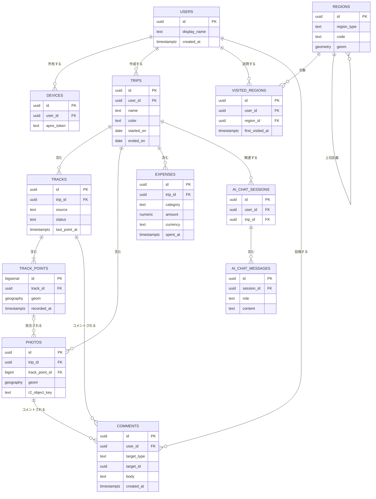

# データモデル

PostgreSQL 16 + PostGIS を前提とする。位置情報には PostGIS の `geography(Point,4326)`（地点）/ `geometry(MultiPolygon,4326)`（行政区画）を用いる。全テーブルに `user_id` を持たせ、将来のマルチユーザー化に備える（MVPでは単一ユーザーをシード）。時刻はすべて `timestamptz`（UTC保存）とする。

## エンティティ定義

### users（ユーザー）
将来のマルチユーザー化のために用意。MVPでは1行をシードして使う。

| カラム | 型 | 制約 | 説明 |
|---|---|---|---|
| id | uuid | PK | ユーザーID |
| display_name | text | NOT NULL | 表示名 |
| created_at | timestamptz | NOT NULL default now() | 作成日時 |

### devices（端末・プッシュトークン）
通知の送信先となる端末を登録する。

| カラム | 型 | 制約 | 説明 |
|---|---|---|---|
| id | uuid | PK | 端末ID |
| user_id | uuid | FK→users.id, NOT NULL | 所有ユーザー |
| platform | text | NOT NULL | `ios` 等 |
| apns_token | text | NOT NULL | APNsデバイストークン |
| created_at | timestamptz | NOT NULL default now() | 登録日時 |
| updated_at | timestamptz | NOT NULL default now() | 更新日時 |

### trips（旅行 / ラベル単位）
ラベリングの単位。地図上の色分けのキーになる。

| カラム | 型 | 制約 | 説明 |
|---|---|---|---|
| id | uuid | PK | 旅行ID |
| user_id | uuid | FK→users.id, NOT NULL | 所有ユーザー |
| name | text | NOT NULL | 旅行名（ラベル） |
| description | text | NULL可 | メモ |
| color | text | NOT NULL | 地図表示色（HEX。例 `#E8833A`） |
| started_on | date | NULL可 | 旅行開始日 |
| ended_on | date | NULL可 | 旅行終了日 |
| created_at | timestamptz | NOT NULL default now() | 作成日時 |
| updated_at | timestamptz | NOT NULL default now() | 更新日時 |

### tracks（トラック / トラッキングセッション or インポートGPX）
1旅行に複数持てる。ライブ記録とGPXインポートを区別する。

| カラム | 型 | 制約 | 説明 |
|---|---|---|---|
| id | uuid | PK | トラックID |
| trip_id | uuid | FK→trips.id, NOT NULL | 所属旅行 |
| user_id | uuid | FK→users.id, NOT NULL | 所有ユーザー |
| source | text | NOT NULL | `live` / `gpx` |
| status | text | NOT NULL | `recording` / `paused` / `finished` |
| started_at | timestamptz | NULL可 | 記録開始時刻 |
| ended_at | timestamptz | NULL可 | 記録終了時刻 |
| last_point_at | timestamptz | NULL可 | 最後に点を受信した時刻（断絶検知に使用） |
| created_at | timestamptz | NOT NULL default now() | 作成日時 |

### track_points（トラックポイント / 位置情報の1点）
高頻度・大量になるテーブル。空間インデックスと時系列インデックスを張る。

| カラム | 型 | 制約 | 説明 |
|---|---|---|---|
| id | bigserial | PK | 点ID |
| track_id | uuid | FK→tracks.id, NOT NULL | 所属トラック |
| user_id | uuid | FK→users.id, NOT NULL | 所有ユーザー |
| geom | geography(Point,4326) | NOT NULL | 緯度経度（WGS84） |
| elevation_m | double precision | NULL可 | 高度(m) |
| speed_mps | double precision | NULL可 | 速度(m/s) |
| accuracy_m | double precision | NULL可 | 位置精度(m) |
| recorded_at | timestamptz | NOT NULL | 取得時刻 |

推奨インデックス: `GIST(geom)`、`(track_id, recorded_at)`。

### regions（行政区画 参照データ）
訪問判定とトロフィー塗りつぶしの基礎となる境界データ（OSM/自然地球データ等から投入）。

| カラム | 型 | 制約 | 説明 |
|---|---|---|---|
| id | uuid | PK | 区画ID |
| region_type | text | NOT NULL | `country` / `prefecture` / `city` |
| code | text | NOT NULL | 区画コード（ISO国コード/都道府県コード等） |
| name | text | NOT NULL | 区画名 |
| parent_id | uuid | FK→regions.id, NULL可 | 上位区画 |
| geom | geometry(MultiPolygon,4326) | NOT NULL | 区画ポリゴン |

推奨インデックス: `GIST(geom)`、`(region_type, code)`。

### visited_regions（訪問済みエリア / トロフィー）
ユーザーがどの区画をいつ初めて訪れたかを記録する。

| カラム | 型 | 制約 | 説明 |
|---|---|---|---|
| id | uuid | PK | レコードID |
| user_id | uuid | FK→users.id, NOT NULL | 所有ユーザー |
| region_id | uuid | FK→regions.id, NOT NULL | 訪問した区画 |
| first_visited_at | timestamptz | NOT NULL | 初訪問時刻 |
| first_trip_id | uuid | FK→trips.id, NULL可 | 初訪問の旅行 |

一意制約: `(user_id, region_id)`。

### photos（写真）
実体はR2に保管し、DBには地点・メタデータのみを持つ。

| カラム | 型 | 制約 | 説明 |
|---|---|---|---|
| id | uuid | PK | 写真ID |
| trip_id | uuid | FK→trips.id, NOT NULL | 所属旅行 |
| user_id | uuid | FK→users.id, NOT NULL | 所有ユーザー |
| track_point_id | bigint | FK→track_points.id, NULL可 | 突合した最寄り点（任意） |
| geom | geography(Point,4326) | NULL可 | 撮影地点（EXIFまたは突合で決定） |
| location_source | text | NOT NULL | `exif` / `matched` / `unknown` |
| taken_at | timestamptz | NULL可 | 撮影時刻 |
| r2_object_key | text | NOT NULL | R2上のオブジェクトキー（原本） |
| thumbnail_key | text | NULL可 | サムネイルのキー |
| width | int | NULL可 | 幅(px) |
| height | int | NULL可 | 高さ(px) |
| exif | jsonb | NULL可 | その他EXIF |
| created_at | timestamptz | NOT NULL default now() | 取込日時 |

### expenses（家計簿 / 旅費）

| カラム | 型 | 制約 | 説明 |
|---|---|---|---|
| id | uuid | PK | 費用ID |
| trip_id | uuid | FK→trips.id, NOT NULL | 所属旅行 |
| user_id | uuid | FK→users.id, NOT NULL | 所有ユーザー |
| category | text | NOT NULL | 費目（交通/宿泊/食事/観光/その他 等） |
| amount | numeric(12,2) | NOT NULL | 金額 |
| currency | text | NOT NULL | 通貨コード（例 `JPY`） |
| description | text | NULL可 | メモ |
| spent_at | timestamptz | NOT NULL | 支出日時 |
| created_at | timestamptz | NOT NULL default now() | 作成日時 |

### comments（コメント / 日記）
トラックや写真に対して残す感想・メモ。1つの対象に複数つけられ、時系列の日記として振り返れる。対象種別を `target_type` で持つポリモーフィック構造とし、将来トリップ等への拡張も可能にする。

| カラム | 型 | 制約 | 説明 |
|---|---|---|---|
| id | uuid | PK | コメントID |
| user_id | uuid | FK→users.id, NOT NULL | 投稿ユーザー |
| target_type | text | NOT NULL | 対象種別 `track` / `photo`（将来 `trip` 等） |
| target_id | uuid | NOT NULL | 対象のID（target_typeに応じて tracks/photos を指す） |
| body | text | NOT NULL | 本文（感想・日記） |
| created_at | timestamptz | NOT NULL default now() | 投稿日時 |
| updated_at | timestamptz | NOT NULL default now() | 更新日時 |

推奨インデックス: `(target_type, target_id, created_at)`。アプリ側で対象の存在を保証する（DBレベルの複合FKは張らず、サービス層で検証）。

### ai_chat_sessions（AIチャット セッション）

| カラム | 型 | 制約 | 説明 |
|---|---|---|---|
| id | uuid | PK | セッションID |
| user_id | uuid | FK→users.id, NOT NULL | 所有ユーザー |
| trip_id | uuid | FK→trips.id, NULL可 | 関連旅行（任意） |
| title | text | NULL可 | セッション表題 |
| created_at | timestamptz | NOT NULL default now() | 作成日時 |

### ai_chat_messages（AIチャット メッセージ）

| カラム | 型 | 制約 | 説明 |
|---|---|---|---|
| id | uuid | PK | メッセージID |
| session_id | uuid | FK→ai_chat_sessions.id, NOT NULL | 所属セッション |
| role | text | NOT NULL | `user` / `assistant` |
| content | text | NOT NULL | 本文 |
| created_at | timestamptz | NOT NULL default now() | 作成日時 |

## ER図

主要エンティティの関連を示す。`users` を起点に、旅行（trips）配下にトラック・写真・家計簿・AIセッションがぶら下がる。訪問済みエリア（visited_regions）は参照データ regions と紐づく。

## 補足: カバレッジ（訪問判定）の考え方

新しいトラックポイントが確定したら、`regions` に対して `ST_Contains` / `ST_Intersects` で内包する区画を引き、未訪問なら `visited_regions` に `(user_id, region_id)` を一意制約付きで挿入する（初訪問時刻と旅行を記録）。地図のトロフィー塗りつぶしは、`visited_regions` と `regions.geom` を結合してGeoJSON（またはベクタータイル）として返し、MapLibreのFillレイヤーで描画する。点が大量になるため、判定は新規受信分のみを対象に増分実行する。将来的に、より細かい網羅感を出したい場合は H3 ヘクスセル単位のカバレッジを追加する余地を残す。
