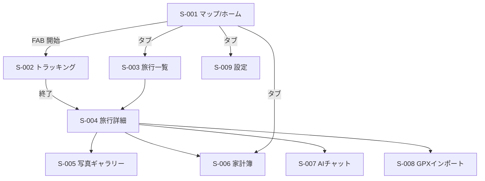
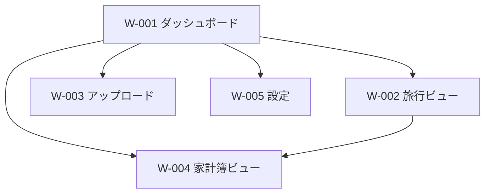

# 画面設計

## Figmaファイル

- URL: 未作成（本書の仕様に基づき作成予定）
- 補足: ビジュアル（配色・余白・実寸レイアウト）はFigmaを正とし、本書はその設計仕様（情報設計・要素・状態・遷移）とする。Figmaでは「Mobile（iOS, 390×844想定）」と「Web（Desktop, 1440幅想定）」の2フレームセットを作成する。

## デザイントークン（Figma作成時の指針）

地図が主役のため、UIは彩度を抑え、アクセント（訪問エリア・トロフィー・記録中状態）に暖色を使って「埋まっていく達成感」を演出する。

| 項目 | 値 |
|---|---|
| プライマリカラー | `#1B6B5B`（ディープティール / 探検感） |
| アクセントカラー | `#E8833A`（サンセットオレンジ / トロフィー・記録中） |
| 背景 / サーフェス | 背景 `#FBFAF6`（ウォームオフホワイト） / サーフェス `#FFFFFF` |
| テキスト色 | 主 `#20292B` / 副 `#6B7472` |
| 状態色 | 成功 `#2E9E6B` / 警告 `#E0A52E` / 危険 `#D1495B`（断絶警告に使用） |
| フォント | Inter（欧文）/ Noto Sans JP（和文）。見出しは Semibold、本文 Regular |
| 基準余白 / 角丸 | 8pxグリッド（4/8/16/24）/ 角丸 12px（カード）・8px（ボタン） |
| 旅行ラベル色パレット | ティール/オレンジ/ブルー/パープル/グリーン/レッド/イエロー の7色から選択 |

## 画面一覧

P列: M=モバイル(iOS) / W=Web。

| 画面ID | P | 画面名 | 概要 | 主な機能 |
|---|---|---|---|---|
| S-001 | M | マップ（ホーム） | 全旅行の経路・訪問エリアを表示するメイン地図 | 経路/塗りつぶし表示, 旅行フィルタ, トラッキング開始導線 |
| S-002 | M | トラッキング | 記録中の状態表示と開始/一時停止/終了 | 記録制御, 経過/距離表示, 断絶警告バナー |
| S-003 | M | 旅行一覧 | 旅行（トリップ）の一覧 | 作成, 検索, 各旅行へ遷移 |
| S-004 | M | 旅行詳細 | 1旅行の経路・写真・家計簿サマリ | ラベル/色編集, トラック一覧, 各機能への導線 |
| S-005 | M | 写真ギャラリー | 旅行の写真一覧・地図ピン | 一覧/地図切替, 写真詳細 |
| S-006 | M | 家計簿 | 旅費の入力・一覧・集計 | 費用追加/編集, 費目別集計 |
| S-007 | M | AIチャット | おすすめ経路の相談 | メッセージ送受信, セッション管理 |
| S-008 | M | GPXインポート | GPXファイルの取り込み | ファイル選択, 取込先旅行の指定 |
| S-009 | M | 設定 | トラッキング/通知/データ管理 | 取得間隔, 通知設定, エクスポート/削除 |
| W-001 | W | ダッシュボード | 地図＋統計（訪問数・カバー率・トロフィー） | 全体地図, 統計カード, ハイライト |
| W-002 | W | 旅行ビュー | 旅行一覧/詳細（経路・写真・家計簿） | 旅行切替, 経路/写真/費用の閲覧 |
| W-003 | W | アップロード | GPX/画像のアップロード | ドラッグ&ドロップ, 取込先旅行の指定 |
| W-004 | W | 家計簿ビュー | 旅費の一覧・グラフ | 費目別/期間別集計, CSV出力(将来) |
| W-005 | W | 設定 | データ管理・表示設定 | エクスポート, 地図表示設定 |

## 各画面のFigma向け設計仕様

### マップ / ホーム（S-001）
- 目的: アプリを開いた瞬間に「自分の足跡（経路）と埋まった土地（訪問エリア）」が一望できること。
- レイアウト構成: 全画面地図（MapLibre）＋上部にフィルタチップ（旅行ラベル）＋右下にFAB（トラッキング開始）＋下部タブバー。
- 主な表示要素: 経路ポリライン（旅行色）、訪問エリアのFill塗りつぶし（アクセント半透明）、撮影写真のピン（サムネ付き。密集時はクラスタ表示）、現在地ピン、トロフィー進捗の小バッジ。
- 状態: 通常 / 位置許可未取得（許可を促すバナー）/ データ空（「最初の旅行を作る」CTA）/ ローディング。
- 主な操作と遷移先: FAB→S-002、フィルタチップ→表示絞り込み、写真ピンのタップ→写真詳細（プレビュー＋コメント）、タブ→S-003/S-006/S-009。
- 補足: 写真ピン・経路・訪問エリアは個別にレイヤー表示ON/OFFできる（地図が煩雑になりすぎないように）。

### トラッキング（S-002）
- 目的: 記録中の安心感（ちゃんと取れているか）と、断絶時の即時の気づき。
- レイアウト構成: 上部に小さな地図プレビュー、中央に大きなステータス（記録中/一時停止）、経過時間・距離・点数、下部に開始/一時停止/終了ボタン。
- 主な表示要素: 記録中インジケータ（アクセント色の点滅）、現在の旅行ラベル、断絶警告バナー（危険色、「5分間位置が取得できていません」）。
- 状態: 記録中 / 一時停止 / 断絶警告 / 終了確認モーダル / 圏外（ローカル蓄積中の表示）。
- 主な操作と遷移先: 終了→S-004（該当旅行詳細）。

### 旅行一覧（S-003）
- 目的: 過去の旅行への入口。
- レイアウト構成: リスト（カード）。各カードに旅行名・期間・ラベル色・サムネ（経路or写真）・訪問区画数。上部に「新規作成」。
- 状態: 通常 / 空 / ローディング。
- 主な操作と遷移先: カード→S-004、新規作成→作成モーダル。

### 旅行詳細（S-004）
- 目的: 1つの旅行の全情報のハブ。
- レイアウト構成: 上部に旅行情報（名称・期間・色編集）、地図（この旅行の経路）、その下にセクション（トラック一覧 / 写真 / 家計簿サマリ / AIに相談）。各トラックには時系列のコメント（日記）スレッドを持ち、その場で追記できる入力欄を備える。
- 状態: 通常 / 写真同期中 / コメント投稿中 / 空。
- 主な操作と遷移先: 写真→S-005、家計簿→S-006、AI→S-007、GPX追加→S-008。トラックのコメント追加/編集/削除。

### 写真ギャラリー（S-005）
- 目的: 撮影地点と紐づいた写真の閲覧。
- レイアウト構成: 上部トグル（グリッド / 地図）。地図表示時は写真ピン、グリッド時はサムネ格子。
- 状態: 通常 / 位置不明の写真（地図外グループ表示）/ コメント投稿中 / 空。
- 主な操作と遷移先: 写真タップ→詳細（拡大・撮影地点・時刻、および時系列コメント＝日記の閲覧と追記）。

### 家計簿（S-006）
- 目的: 旅費の素早い記録と把握。
- レイアウト構成: 上部に合計と費目別の小グラフ、下部に費用リスト、右下にFAB（追加）。
- 主な表示要素: 費目別集計（ドーナツ/バー）、通貨表記、日別小計。
- 状態: 通常 / 空 / 追加・編集モーダル。

### AIチャット（S-007）
- 目的: 次の目的地・立ち寄り先の相談。
- レイアウト構成: 一般的なチャットUI（吹き出し）＋下部入力欄。文脈に現在の旅行・現在地を任意で付与。
- 状態: 通常 / 応答ストリーミング中 / エラー（再試行）。
- 主な操作と遷移先: 提案地点を地図で確認（S-001/S-004へ）。

### GPXインポート（S-008）
- 目的: 既存のGPX軌跡を取り込む。
- レイアウト構成: ファイル選択、取込先の旅行選択（新規 or 既存）、プレビュー（点数・距離）、取込ボタン。
- 状態: 選択前 / 解析中 / 取込確認 / 完了。

### 設定（S-009）
- 目的: トラッキング挙動・通知・データの管理。
- 主な表示要素: 位置取得間隔、断絶通知のしきい値（既定5分）、通知ON/OFF、写真自動同期ON/OFF、データのエクスポート/削除。

### Webダッシュボード（W-001）
- 目的: 帰宅後にPCの大画面で旅を俯瞰し、コレクションの達成感を味わう。
- レイアウト構成: 左に統計サイドバー（訪問国/都道府県/市区町村数・カバー率・トロフィー）、中央に大きな地図、上部に旅行フィルタ。
- 状態: 通常 / 空 / ローディング。

### Webアップロード（W-003）
- 目的: ブラウザからGPX/画像をまとめて投入。
- レイアウト構成: ドラッグ&ドロップ領域、取込先旅行の指定、アップロード進捗一覧。
- 状態: 待機 / アップロード中 / 完了 / 一部失敗（再試行）。

## 画面遷移図（モバイル）

下部タブ（マップ / 旅行 / 家計簿 / 設定）を基点とした主要遷移を示す。

## 画面遷移図（Web）

