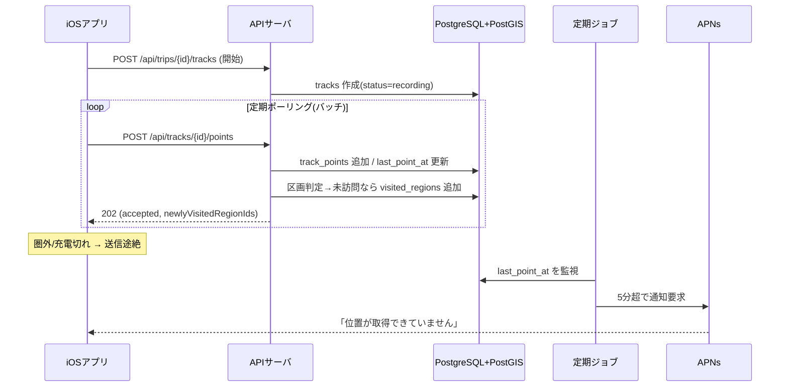
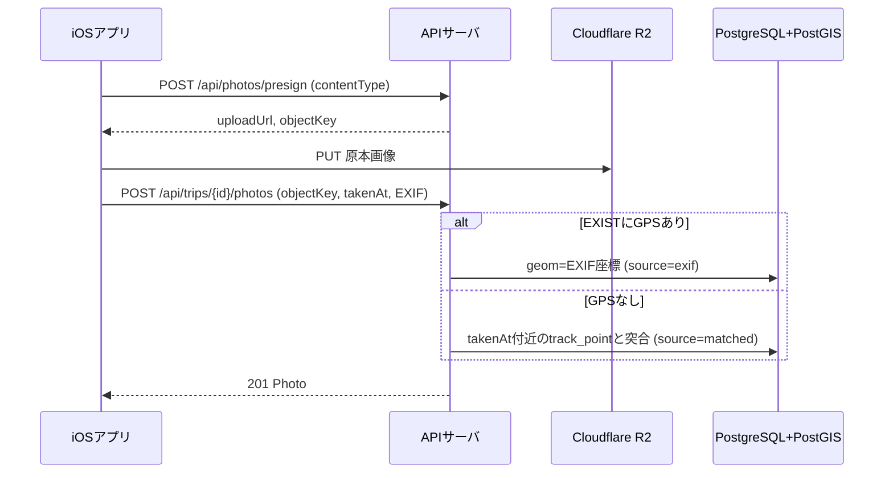
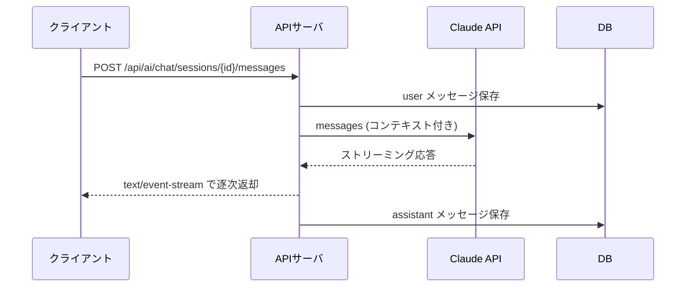

# API設計

APIは OpenAPI(Swagger) 3.0 形式で定義する。機械可読版は同梱の `openapi.yaml` を正とし、本書には人が読むための概要・シーケンス・全文を併載する。

## 共通仕様

- ベースURL: `https://api.triplog.local`（自宅サーバ）。将来のAWS移行先は `https://api.triplog.example.com`。接続先は環境変数で切り替える。
- 認証方式: MVPは認証なし（単一ユーザー）。ただし自宅サーバ公開時は `X-API-Key` ヘッダによる共有シークレットでの簡易保護を推奨。将来は Bearer/JWT に置き換え可能な設計とする。
- レスポンス形式: `application/json`。地図向けの軌跡・カバレッジ取得は `application/geo+json`（GeoJSON）。
- 座標表現: GeoJSON準拠で経度・緯度の順。内部保存は WGS84（SRID 4326）。
- エラー共通フォーマット: `{ "code": string, "message": string }`。HTTPステータスは 400（不正）/ 404（不存在）/ 401（キー不正・公開時）/ 500（サーバ）を用いる。
- 時刻: ISO 8601（UTC）。

## エンドポイント一覧（概要）

| メソッド | パス | 概要 | 認証 |
|---|---|---|---|
| GET | /api/trips | 旅行一覧の取得 | 任意 |
| POST | /api/trips | 旅行の作成 | 任意 |
| GET | /api/trips/{tripId} | 旅行の取得 | 任意 |
| PATCH | /api/trips/{tripId} | 旅行の更新（名称・色・期間） | 任意 |
| DELETE | /api/trips/{tripId} | 旅行の削除 | 任意 |
| GET | /api/trips/{tripId}/tracks | 旅行内トラック一覧 | 任意 |
| POST | /api/trips/{tripId}/tracks | トラック開始（ライブ記録） | 任意 |
| GET | /api/tracks/{trackId} | トラック取得（メタ） | 任意 |
| PATCH | /api/tracks/{trackId} | トラック状態更新（一時停止/終了） | 任意 |
| GET | /api/tracks/{trackId}/points | 軌跡をGeoJSONで取得（簡略化可） | 任意 |
| POST | /api/tracks/{trackId}/points | トラックポイントのバッチ投入 | 任意 |
| POST | /api/trips/{tripId}/import/gpx | GPXインポート | 任意 |
| POST | /api/photos/presign | 写真アップロード用署名付きURL発行 | 任意 |
| GET | /api/photos | 写真の取得（マップ表示用・全旅行横断） | 任意 |
| GET | /api/trips/{tripId}/photos | 旅行の写真一覧 | 任意 |
| POST | /api/trips/{tripId}/photos | 写真メタデータ登録 | 任意 |
| GET | /api/tracks/{trackId}/comments | トラックのコメント一覧（日記） | 任意 |
| POST | /api/tracks/{trackId}/comments | トラックへコメント追加 | 任意 |
| GET | /api/photos/{photoId}/comments | 写真のコメント一覧（日記） | 任意 |
| POST | /api/photos/{photoId}/comments | 写真へコメント追加 | 任意 |
| PATCH | /api/comments/{commentId} | コメント更新 | 任意 |
| DELETE | /api/comments/{commentId} | コメント削除 | 任意 |
| GET | /api/trips/{tripId}/expenses | 旅費一覧 | 任意 |
| POST | /api/trips/{tripId}/expenses | 旅費追加 | 任意 |
| GET | /api/trips/{tripId}/expenses/summary | 旅費集計 | 任意 |
| PATCH | /api/expenses/{expenseId} | 旅費更新 | 任意 |
| DELETE | /api/expenses/{expenseId} | 旅費削除 | 任意 |
| GET | /api/coverage | 訪問済みエリア＋統計（トロフィー） | 任意 |
| POST | /api/ai/chat/sessions | AIチャットセッション作成 | 任意 |
| POST | /api/ai/chat/sessions/{sessionId}/messages | メッセージ送信（SSEで応答） | 任意 |
| POST | /api/devices | 端末（APNsトークン）登録 | 任意 |
| DELETE | /api/devices/{deviceId} | 端末登録解除 | 任意 |

「認証=任意」は、MVPでは無効、公開時は `X-API-Key` を必須化する、の意。

## 主要なやり取りのシーケンス

### トラッキングと断絶検知

モバイルは点をバッファしてバッチ送信する。サーバは受信のたびに `last_point_at` を更新し、新規点が内包する行政区画を判定して未訪問なら訪問記録を作る。定期ジョブが `last_point_at` を監視し、記録中なのに既定5分を超えて受信が無ければ通知する。



### 写真の同期とマッピング

写真はサーバを経由せず、署名付きURLでR2へ直接アップロードする。アップロード後にメタデータを登録し、EXIFのGPS、無ければ撮影時刻とトラックの突合で地点を決める。



### AIおすすめ経路チャット

クライアントのメッセージに現在地・旅行コンテキストを任意付与し、サーバが Claude API へ中継、応答をSSEでストリーミングする。



## OpenAPI定義

以下は `openapi.yaml` と同内容（抜粋ではなく全文）。実装・ツール連携時は `openapi.yaml` を参照すること。

```yaml
openapi: 3.0.3
info:
  title: TripLog API
  version: 0.1.0
  description: >-
    TripLog のバックエンドAPI。MVPは単一ユーザー・認証なしを基本とするが、
    自宅サーバをインターネット公開する場合に備え、共有シークレット（APIキー）による
    簡易保護を任意で有効化できる。位置情報は PostGIS で扱い、地図向けの取得系では
    GeoJSON を返す。写真は R2 への署名付きURLアップロードを用いる。
servers:
  - url: https://api.triplog.local
    description: 自宅サーバ（開発・初期運用）
  - url: https://api.triplog.example.com
    description: 将来のAWS移行先

security:
  - apiKey: []

tags:
  - name: trips
  - name: tracks
  - name: track-points
  - name: import
  - name: photos
  - name: comments
  - name: expenses
  - name: coverage
  - name: ai
  - name: devices

paths:
  /api/trips:
    get:
      tags: [trips]
      summary: 旅行一覧の取得
      responses:
        '200':
          description: 成功
          content:
            application/json:
              schema:
                type: array
                items: { $ref: '#/components/schemas/Trip' }
    post:
      tags: [trips]
      summary: 旅行の作成
      requestBody:
        required: true
        content:
          application/json:
            schema: { $ref: '#/components/schemas/TripCreate' }
      responses:
        '201':
          description: 作成成功
          content:
            application/json:
              schema: { $ref: '#/components/schemas/Trip' }
        '400': { $ref: '#/components/responses/BadRequest' }

  /api/trips/{tripId}:
    parameters:
      - $ref: '#/components/parameters/TripId'
    get:
      tags: [trips]
      summary: 旅行の取得
      responses:
        '200':
          description: 成功
          content:
            application/json:
              schema: { $ref: '#/components/schemas/Trip' }
        '404': { $ref: '#/components/responses/NotFound' }
    patch:
      tags: [trips]
      summary: 旅行の更新（名称・色・期間など）
      requestBody:
        required: true
        content:
          application/json:
            schema: { $ref: '#/components/schemas/TripUpdate' }
      responses:
        '200':
          description: 更新成功
          content:
            application/json:
              schema: { $ref: '#/components/schemas/Trip' }
        '404': { $ref: '#/components/responses/NotFound' }
    delete:
      tags: [trips]
      summary: 旅行の削除
      responses:
        '204': { description: 削除成功 }
        '404': { $ref: '#/components/responses/NotFound' }

  /api/trips/{tripId}/tracks:
    parameters:
      - $ref: '#/components/parameters/TripId'
    get:
      tags: [tracks]
      summary: 旅行内のトラック一覧
      responses:
        '200':
          description: 成功
          content:
            application/json:
              schema:
                type: array
                items: { $ref: '#/components/schemas/Track' }
    post:
      tags: [tracks]
      summary: トラックの開始（ライブ記録セッションの作成）
      requestBody:
        required: true
        content:
          application/json:
            schema: { $ref: '#/components/schemas/TrackCreate' }
      responses:
        '201':
          description: 作成成功
          content:
            application/json:
              schema: { $ref: '#/components/schemas/Track' }

  /api/tracks/{trackId}:
    parameters:
      - $ref: '#/components/parameters/TrackId'
    get:
      tags: [tracks]
      summary: トラックの取得（メタ情報）
      responses:
        '200':
          description: 成功
          content:
            application/json:
              schema: { $ref: '#/components/schemas/Track' }
        '404': { $ref: '#/components/responses/NotFound' }
    patch:
      tags: [tracks]
      summary: トラックの状態更新（一時停止・終了）
      requestBody:
        required: true
        content:
          application/json:
            schema:
              type: object
              properties:
                status:
                  type: string
                  enum: [recording, paused, finished]
      responses:
        '200':
          description: 更新成功
          content:
            application/json:
              schema: { $ref: '#/components/schemas/Track' }

  /api/tracks/{trackId}/points:
    parameters:
      - $ref: '#/components/parameters/TrackId'
    get:
      tags: [track-points]
      summary: トラックの軌跡をGeoJSON（LineString）で取得
      parameters:
        - name: simplify
          in: query
          description: 表示用の簡略化許容誤差(m)。ズームに応じた間引きに使う
          schema: { type: number }
      responses:
        '200':
          description: 成功（GeoJSON Feature）
          content:
            application/geo+json:
              schema: { $ref: '#/components/schemas/GeoJsonFeature' }
    post:
      tags: [track-points]
      summary: トラックポイントのバッチ投入（オフライン蓄積分の再送を含む）
      description: >-
        モバイルはバッファした点をまとめて送る。サーバは last_point_at を更新し、
        新規点が内包する行政区画を判定して未訪問なら visited_regions に記録する。
      requestBody:
        required: true
        content:
          application/json:
            schema: { $ref: '#/components/schemas/TrackPointBatch' }
      responses:
        '202':
          description: 受理（取り込み結果サマリ）
          content:
            application/json:
              schema:
                type: object
                properties:
                  accepted: { type: integer }
                  newlyVisitedRegionIds:
                    type: array
                    items: { type: string, format: uuid }

  /api/trips/{tripId}/import/gpx:
    parameters:
      - $ref: '#/components/parameters/TripId'
    post:
      tags: [import]
      summary: GPXファイルのインポート（トラックとして取り込み）
      requestBody:
        required: true
        content:
          multipart/form-data:
            schema:
              type: object
              properties:
                file:
                  type: string
                  format: binary
      responses:
        '201':
          description: 取込成功（作成されたトラック）
          content:
            application/json:
              schema: { $ref: '#/components/schemas/Track' }
        '400': { $ref: '#/components/responses/BadRequest' }

  /api/photos:
    get:
      tags: [photos]
      summary: 写真の取得（マップ表示用。全旅行横断・地点付き）
      description: メインのマップ画面に写真ピンを表示するために使う。bboxやtripIdで絞り込める。
      parameters:
        - name: bbox
          in: query
          description: '表示範囲 [minLng,minLat,maxLng,maxLat]。カンマ区切り'
          schema: { type: string }
        - name: tripId
          in: query
          schema: { type: string, format: uuid }
        - name: hasLocation
          in: query
          description: 地点が確定している写真のみ返すか
          schema: { type: boolean, default: true }
      responses:
        '200':
          description: 成功
          content:
            application/json:
              schema:
                type: array
                items: { $ref: '#/components/schemas/Photo' }

  /api/photos/presign:
    post:
      tags: [photos]
      summary: 写真アップロード用の署名付きURL発行
      description: クライアントは返却されたURLへ直接 PUT して原本をR2へ置く
      requestBody:
        required: true
        content:
          application/json:
            schema:
              type: object
              required: [contentType]
              properties:
                contentType: { type: string, example: image/jpeg }
      responses:
        '200':
          description: 成功
          content:
            application/json:
              schema:
                type: object
                properties:
                  uploadUrl: { type: string, format: uri }
                  objectKey: { type: string }
                  expiresIn: { type: integer, description: 有効秒数 }

  /api/trips/{tripId}/photos:
    parameters:
      - $ref: '#/components/parameters/TripId'
    get:
      tags: [photos]
      summary: 旅行の写真一覧（地点付き）
      responses:
        '200':
          description: 成功
          content:
            application/json:
              schema:
                type: array
                items: { $ref: '#/components/schemas/Photo' }
    post:
      tags: [photos]
      summary: アップロード済み写真のメタデータ登録
      description: R2へPUT後に呼ぶ。EXIF/撮影時刻から地点を決定（無ければトラック突合）
      requestBody:
        required: true
        content:
          application/json:
            schema: { $ref: '#/components/schemas/PhotoRegister' }
      responses:
        '201':
          description: 登録成功
          content:
            application/json:
              schema: { $ref: '#/components/schemas/Photo' }

  /api/tracks/{trackId}/comments:
    parameters:
      - $ref: '#/components/parameters/TrackId'
    get:
      tags: [comments]
      summary: トラックのコメント一覧（時系列の日記）
      responses:
        '200':
          description: 成功
          content:
            application/json:
              schema:
                type: array
                items: { $ref: '#/components/schemas/Comment' }
    post:
      tags: [comments]
      summary: トラックへのコメント追加
      requestBody:
        required: true
        content:
          application/json:
            schema: { $ref: '#/components/schemas/CommentCreate' }
      responses:
        '201':
          description: 作成成功
          content:
            application/json:
              schema: { $ref: '#/components/schemas/Comment' }

  /api/photos/{photoId}/comments:
    parameters:
      - name: photoId
        in: path
        required: true
        schema: { type: string, format: uuid }
    get:
      tags: [comments]
      summary: 写真のコメント一覧（時系列の日記）
      responses:
        '200':
          description: 成功
          content:
            application/json:
              schema:
                type: array
                items: { $ref: '#/components/schemas/Comment' }
    post:
      tags: [comments]
      summary: 写真へのコメント追加
      requestBody:
        required: true
        content:
          application/json:
            schema: { $ref: '#/components/schemas/CommentCreate' }
      responses:
        '201':
          description: 作成成功
          content:
            application/json:
              schema: { $ref: '#/components/schemas/Comment' }

  /api/comments/{commentId}:
    parameters:
      - name: commentId
        in: path
        required: true
        schema: { type: string, format: uuid }
    patch:
      tags: [comments]
      summary: コメントの更新
      requestBody:
        required: true
        content:
          application/json:
            schema: { $ref: '#/components/schemas/CommentCreate' }
      responses:
        '200':
          description: 更新成功
          content:
            application/json:
              schema: { $ref: '#/components/schemas/Comment' }
    delete:
      tags: [comments]
      summary: コメントの削除
      responses:
        '204': { description: 削除成功 }

  /api/trips/{tripId}/expenses:
    parameters:
      - $ref: '#/components/parameters/TripId'
    get:
      tags: [expenses]
      summary: 旅費の一覧
      responses:
        '200':
          description: 成功
          content:
            application/json:
              schema:
                type: array
                items: { $ref: '#/components/schemas/Expense' }
    post:
      tags: [expenses]
      summary: 旅費の追加
      requestBody:
        required: true
        content:
          application/json:
            schema: { $ref: '#/components/schemas/ExpenseCreate' }
      responses:
        '201':
          description: 作成成功
          content:
            application/json:
              schema: { $ref: '#/components/schemas/Expense' }

  /api/trips/{tripId}/expenses/summary:
    parameters:
      - $ref: '#/components/parameters/TripId'
    get:
      tags: [expenses]
      summary: 旅費の集計（費目別・合計）
      responses:
        '200':
          description: 成功
          content:
            application/json:
              schema:
                type: object
                properties:
                  total: { type: number }
                  currency: { type: string }
                  byCategory:
                    type: array
                    items:
                      type: object
                      properties:
                        category: { type: string }
                        amount: { type: number }

  /api/expenses/{expenseId}:
    parameters:
      - name: expenseId
        in: path
        required: true
        schema: { type: string, format: uuid }
    patch:
      tags: [expenses]
      summary: 旅費の更新
      requestBody:
        required: true
        content:
          application/json:
            schema: { $ref: '#/components/schemas/ExpenseCreate' }
      responses:
        '200':
          description: 更新成功
          content:
            application/json:
              schema: { $ref: '#/components/schemas/Expense' }
    delete:
      tags: [expenses]
      summary: 旅費の削除
      responses:
        '204': { description: 削除成功 }

  /api/coverage:
    get:
      tags: [coverage]
      summary: 訪問済みエリアと統計の取得
      description: トロフィー塗りつぶし用のGeoJSONと、訪問数・カバー率の統計を返す
      parameters:
        - name: regionType
          in: query
          schema: { type: string, enum: [country, prefecture, city] }
      responses:
        '200':
          description: 成功
          content:
            application/json:
              schema:
                type: object
                properties:
                  stats:
                    type: object
                    properties:
                      visitedCount: { type: integer }
                      totalCount: { type: integer }
                      coverageRate: { type: number }
                  geojson: { $ref: '#/components/schemas/GeoJsonFeatureCollection' }

  /api/ai/chat/sessions:
    post:
      tags: [ai]
      summary: AIチャットセッションの作成
      requestBody:
        required: false
        content:
          application/json:
            schema:
              type: object
              properties:
                tripId: { type: string, format: uuid, nullable: true }
                title: { type: string, nullable: true }
      responses:
        '201':
          description: 作成成功
          content:
            application/json:
              schema: { $ref: '#/components/schemas/AiChatSession' }

  /api/ai/chat/sessions/{sessionId}/messages:
    parameters:
      - name: sessionId
        in: path
        required: true
        schema: { type: string, format: uuid }
    post:
      tags: [ai]
      summary: メッセージ送信（おすすめ経路を相談、応答はSSEでストリーミング）
      description: >-
        現在地・現在の旅行コンテキストを任意で付与できる。サーバは Claude API へ中継し、
        text/event-stream で応答をストリーミングする。
      requestBody:
        required: true
        content:
          application/json:
            schema:
              type: object
              required: [content]
              properties:
                content: { type: string }
                context:
                  type: object
                  properties:
                    near: { $ref: '#/components/schemas/LngLat' }
                    tripId: { type: string, format: uuid, nullable: true }
      responses:
        '200':
          description: SSEストリーム（assistantの応答）
          content:
            text/event-stream:
              schema: { type: string }

  /api/devices:
    post:
      tags: [devices]
      summary: 端末（APNsトークン）の登録
      requestBody:
        required: true
        content:
          application/json:
            schema:
              type: object
              required: [platform, apnsToken]
              properties:
                platform: { type: string, example: ios }
                apnsToken: { type: string }
      responses:
        '201':
          description: 登録成功
          content:
            application/json:
              schema: { $ref: '#/components/schemas/Device' }

  /api/devices/{deviceId}:
    parameters:
      - name: deviceId
        in: path
        required: true
        schema: { type: string, format: uuid }
    delete:
      tags: [devices]
      summary: 端末の登録解除
      responses:
        '204': { description: 削除成功 }

components:
  securitySchemes:
    apiKey:
      type: apiKey
      in: header
      name: X-API-Key
      description: 自宅サーバ公開時の簡易保護。将来はBearer/JWTに置き換え可能。

  parameters:
    TripId:
      name: tripId
      in: path
      required: true
      schema: { type: string, format: uuid }
    TrackId:
      name: trackId
      in: path
      required: true
      schema: { type: string, format: uuid }

  responses:
    BadRequest:
      description: リクエスト不正
      content:
        application/json:
          schema: { $ref: '#/components/schemas/Error' }
    NotFound:
      description: 対象が存在しない
      content:
        application/json:
          schema: { $ref: '#/components/schemas/Error' }

  schemas:
    Error:
      type: object
      properties:
        code: { type: string }
        message: { type: string }
    LngLat:
      type: object
      description: '[経度, 緯度] の順（GeoJSON準拠）'
      properties:
        lng: { type: number }
        lat: { type: number }
    GeoJsonFeature:
      type: object
      properties:
        type: { type: string, example: Feature }
        geometry: { type: object }
        properties: { type: object }
    GeoJsonFeatureCollection:
      type: object
      properties:
        type: { type: string, example: FeatureCollection }
        features:
          type: array
          items: { $ref: '#/components/schemas/GeoJsonFeature' }
    Trip:
      type: object
      properties:
        id: { type: string, format: uuid }
        name: { type: string }
        description: { type: string, nullable: true }
        color: { type: string, example: '#E8833A' }
        startedOn: { type: string, format: date, nullable: true }
        endedOn: { type: string, format: date, nullable: true }
        createdAt: { type: string, format: date-time }
    TripCreate:
      type: object
      required: [name, color]
      properties:
        name: { type: string }
        description: { type: string, nullable: true }
        color: { type: string }
        startedOn: { type: string, format: date, nullable: true }
        endedOn: { type: string, format: date, nullable: true }
    TripUpdate:
      type: object
      properties:
        name: { type: string }
        description: { type: string, nullable: true }
        color: { type: string }
        startedOn: { type: string, format: date, nullable: true }
        endedOn: { type: string, format: date, nullable: true }
    Track:
      type: object
      properties:
        id: { type: string, format: uuid }
        tripId: { type: string, format: uuid }
        source: { type: string, enum: [live, gpx] }
        status: { type: string, enum: [recording, paused, finished] }
        startedAt: { type: string, format: date-time, nullable: true }
        endedAt: { type: string, format: date-time, nullable: true }
        lastPointAt: { type: string, format: date-time, nullable: true }
        pointCount: { type: integer }
    TrackCreate:
      type: object
      properties:
        source: { type: string, enum: [live, gpx], default: live }
        startedAt: { type: string, format: date-time }
    TrackPoint:
      type: object
      required: [lng, lat, recordedAt]
      properties:
        lng: { type: number }
        lat: { type: number }
        elevationM: { type: number, nullable: true }
        speedMps: { type: number, nullable: true }
        accuracyM: { type: number, nullable: true }
        recordedAt: { type: string, format: date-time }
    TrackPointBatch:
      type: object
      required: [points]
      properties:
        points:
          type: array
          items: { $ref: '#/components/schemas/TrackPoint' }
    Photo:
      type: object
      properties:
        id: { type: string, format: uuid }
        tripId: { type: string, format: uuid }
        lng: { type: number, nullable: true }
        lat: { type: number, nullable: true }
        locationSource: { type: string, enum: [exif, matched, unknown] }
        takenAt: { type: string, format: date-time, nullable: true }
        objectKey: { type: string }
        thumbnailUrl: { type: string, format: uri, nullable: true }
        width: { type: integer, nullable: true }
        height: { type: integer, nullable: true }
    PhotoRegister:
      type: object
      required: [objectKey]
      properties:
        objectKey: { type: string }
        takenAt: { type: string, format: date-time, nullable: true }
        lng: { type: number, nullable: true }
        lat: { type: number, nullable: true }
        width: { type: integer, nullable: true }
        height: { type: integer, nullable: true }
        exif: { type: object, nullable: true }
    Expense:
      type: object
      properties:
        id: { type: string, format: uuid }
        tripId: { type: string, format: uuid }
        category: { type: string }
        amount: { type: number }
        currency: { type: string, example: JPY }
        description: { type: string, nullable: true }
        spentAt: { type: string, format: date-time }
    ExpenseCreate:
      type: object
      required: [category, amount, currency, spentAt]
      properties:
        category: { type: string }
        amount: { type: number }
        currency: { type: string }
        description: { type: string, nullable: true }
        spentAt: { type: string, format: date-time }
    AiChatSession:
      type: object
      properties:
        id: { type: string, format: uuid }
        tripId: { type: string, format: uuid, nullable: true }
        title: { type: string, nullable: true }
        createdAt: { type: string, format: date-time }
    Comment:
      type: object
      properties:
        id: { type: string, format: uuid }
        targetType: { type: string, enum: [track, photo] }
        targetId: { type: string, format: uuid }
        body: { type: string }
        createdAt: { type: string, format: date-time }
        updatedAt: { type: string, format: date-time }
    CommentCreate:
      type: object
      required: [body]
      properties:
        body: { type: string }
    Device:
      type: object
      properties:
        id: { type: string, format: uuid }
        platform: { type: string }
        createdAt: { type: string, format: date-time }
```
